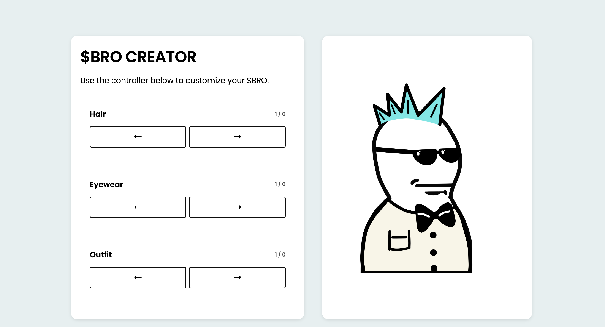

# Bro Visited His Friend Character Creation

I created this character creation screen inspired by the "Bro Visited His Friend" meme, poking fun at the brainrot culture.

## Mockups

Desktop:



## Setup Instructions

This project uses create-react-app.

Start by installing dependencies:

```
npm install
```

Boot up a dev server:

```
npm run start
```

You should be able to access the application at `http://localhost:3001`.

## Project structure and context

This project is built with React.

**All of the functionality has already been built.** Your job is to add the CSS. You're also allowed to tweak the JSX (HTML) as needed. But you shouldn't need to fuss with any advanced React stuff.

This project uses **CSS Modules**. CSS modules are ultimately very similar to vanilla CSS, but the classes are applied in JS. Here's an example:

```css
/* Something.module.css */
.wrapper {
  width: 500px;
}
```

```js
/* Something.js */
import styles from "./Something.module.css";

function Something() {
  return <div className={styles.wrapper}>I'll be 500px wide!</div>;
}
```

Additionally, a few global styles can be found in `src/index.css`.
