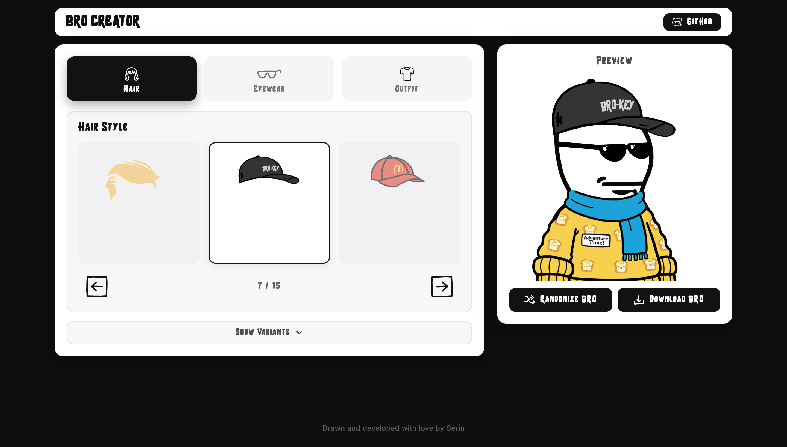

# BRO CREATOR

Make your own BRO. Pick a hair, throw on some shades, choose a fit, hit randomize and download your bro. That is the whole app, and I am not sorry.

It is inspired by the "Bro Visited His Friend" meme and that wonderfully cursed hand drawn art style everyone keeps copying.



## Run it

```
npm install
npm start
```

Then open http://localhost:3000. That is it.

## How it works

The whole system is built around one simple idea: the character is just stacked PNGs.

- The body is a base image. Hair, eyewear and outfit are transparent PNGs layered on top of it. What you see on screen is what you download.
- Every item lives in `public/elements/{hair,eyewear,outfit}` and follows a naming convention like `hair-3.png`. An item can also have color variants, just add `hair-3-v2.png`, `hair-3-v3.png` and so on.
- When you build the app, a small script scans those folders and writes `file-manifest.json` with the item count and variant count for each category.

That manifest is the single source of truth. The app never hardcodes how many items exist, it just asks the manifest. So if you want to add a new hairstyle, you drop `hair-16.png` into the folder and you are done. No components, no config, no code.

A few other things worth knowing:

- A preloader fetches every item image once before the app shows up, so switching between items never pops in late. Color variants keep loading quietly in the background.
- The randomize button runs a little slot machine animation on the selection tiles, built with anime.js. The result only commits once the reels stop, so the UI never flickers.
- Every icon in the UI is a hand drawn SVG that matches the wonky style of the character.

## Using the assets

The artwork is free to use for your own projects, fun stuff and memes. All I ask is a little credit: link back to [this repo](https://github.com/egv2) somewhere, and please do not sell the drawings as your own.

## Built with

React, Create React App, CSS Modules, anime.js and a lot of hand-drawn PNGs.
